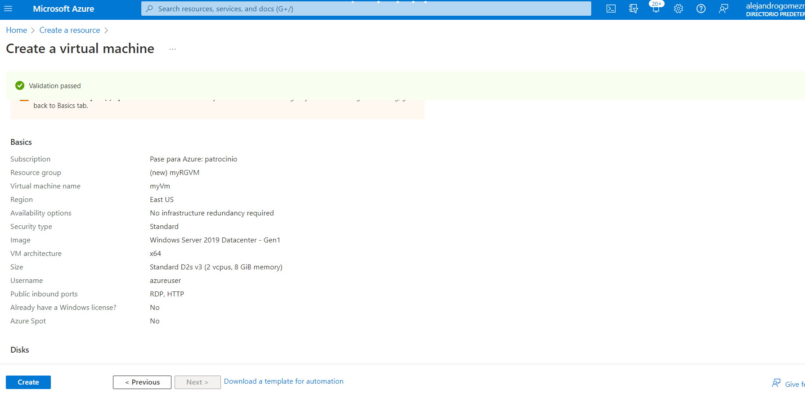

# 01 - Crear una máquina virtual en el portal Azure

En este tutorial vamos a crear una máquina virtual en Azure Portal, para despues conectarnos a dicha máquina virtual. Despues instalaremos la función del servidor web y la probaremos.

## Tarea 1: Crear una máquina virtual (10 minutos)
En esta tarea, crearemos una máquina virtual Windows Server 2019 Datacenter - Gen1.

1. Inicie sesión en [Azure Portal](https://portal.azure.com).

2. Desde la hoja *Todos los servicios*, busque y seleccione *Máquinas virtuales* y luego haga clic en *+ Agregar* y seleccione *+ Maquinas virtuales*.

3. En la pestaña *Datos básicos*, complete la siguiente información (deje los valores predeterminados para todo lo demás):

    | Configuración | Valores |
    |  -- | -- |
    | Suscripción | **Elija su suscripción**|
    | Grupo de recursos | **myRGVM** (crear nueva) |
    | Nombre de la máquina virtual | **myVm** |
    | Ubicación | **Este de EE. UU.**|
    | Imagen | **Windows Server 2019 Datacenter - Gen 1**|
    | Tamaño | Estándar D2s, v3|
    | Nombre de usuario de la cuenta de administrador | **azureuser** |
    | Contraseña de cuenta de administrador | **Pa$$w0rd1234**|
    | Reglas del puerto de entrada: Permitir puertos seleccionados | **RDP (3389)** y **HTTP (80)**|
    | | |

4. Cambie a la pestaña *Redes* y busque *Seleccionar puertos de entrada*:

    | Configuración | Valores |
    | -- | -- |
    | Seleccionar puertos de entrada | **HTTP (80), RDP (3389)**|
    | | |

**Nota:** Comprobar que tanto el puerto 80 como el puerto 3389 están seleccionados.

5. Vaya a la pestaña *Administración* y, en la sección *Supervisión*, seleccione la siguiente configuración:

    | Configuración | Valores |
    | -- | -- |
    | Diagnóstico de arranque | **Deshabilitar**|
    | | |

6. Deje los valores predeterminados restantes y luego haga clic en el botón *Revisar* y *Crear*, en la parte inferior de la página.

7. Una vez que se supere la validación, haga clic en el botón *Crear*. La implementación de la máquina virtual puede demorar entre cinco y siete minutos.

8. Recibirá actualizaciones en la página de implementación y a través del área *Notificaciones* (el icono de la campana en el menú superior).

   **Nota: Compruebe que los puertos 80 y 3389 están abiertos**
